### 👋 Olá tudo bem, meu nome é Adalto Junior, muito obrigado por visitar essa página.. 

- ⚡ Atualmente trabalho como programador de sistemas de informação em um renomado instituto de gestão hospitalar.
- 🔭 Sou formado em *Sistemas Para Internet* com pós-graduação em *Gestão Hospitalar*, e eterno estudante na busca de novas trilhas de aprendizado... 

 
  <!--
  - Adicionando carrão de estatísticas do GitHub || Você pode passar um parâmetro de consulta '&hide=' para ocultar quaisquer estatísticas específicas com valores separados por vírgulas. Opções:&hide=stars,commits,prs,issues,contribs  
  - Com temas embutidos, você pode personalizar a aparência do cartão sem fazer nenhuma personalização manual. Use &theme=THEME_NAME. 
  Ex. dark, radical, merko, gruvbox, , tokyonight, onedark, cobalt, synthwave, highcontrast, dracula.
  - Tema transparente:  Este tema é otimizado para ter uma boa aparência nos temas padrão claro e escuro do GitHub. Você pode ativar este tema usando o &theme=transparentparâmetro da seguinte forma:
  -->

  
  

 
## <!-- linha -->
 
#### 💻 Tecnologias:

 <!--Site: https://devicon.dev-->
  
   
  
  
    
  
  
  
  

## <!-- linha -->

#### 🛠️ IDEs e Ferramentas:

 <!--Site: https://devicon.dev-->
  
    
  
  
  
          

## <!-- linha -->
 
<!---->
 
